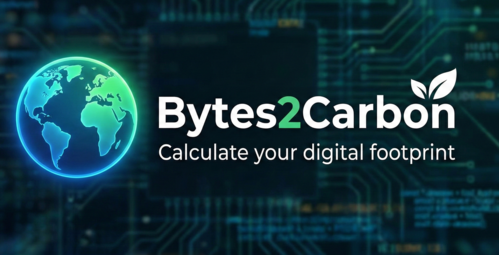

  

## Credits

This project uses a template provided by [[themewagon](https://themewagon.com/themes/milky/)]. We acknowledge and thank them for their work. For more details, visit their website or repository.
## bytes2carbon

This project analyzes and visualizes the carbon footprint and energy efficiency of digital infrastructure, including servers, SSDs, cloud providers, and datacenters. It provides interactive charts and data-driven insights using D3.js and other visualization tools.

### Features
- Data analysis of energy consumption and carbon emissions
- Visualizations for trends, efficiency, and regional comparisons
- CSV datasets for various providers and regions
- Modular JS and CSS for interactive dashboards

### Structure
- `data/` — CSVs and scripts for energy, emissions, and efficiency
- `js/` — Visualization and dashboard scripts
- `css/` — Stylesheets for UI and charts
- `vizpages/` — HTML pages for visualizations

### Usage
To use the project:

1. Clone or download the repository to your local machine.
2. Open `index.html` in your browser to view the main dashboard.
3. For specific visualizations, open any HTML file in the `vizpages/` folder.
4. Data sources are available in the `data/` folder for further analysis or customization.

No installation is required; all visualizations run in the browser. For custom data, replace or add CSV files in the `data/` directory.

#### Cours du Data Vizualisation de UCBL1: [[cours](https://lyondataviz.github.io/teaching/lyon1-m2/2025)]
### Equipe:
- Mohamed AFKIR
- Lokmane AKKOUH
- Mohamed rida BEN TOUHAMI
- Hamza MOTASSIM

### Résumé en anglais
bytes2carbon is a browser-based data visualization project that explores the environmental impact of digital infrastructure. It analyzes energy consumption and carbon emissions across servers, storage devices, cloud providers, and data centers. Using interactive visualizations built with D3.js and CSV datasets, the project helps users understand efficiency trends, regional differences, and sustainability challenges in modern computing infrastructures.

